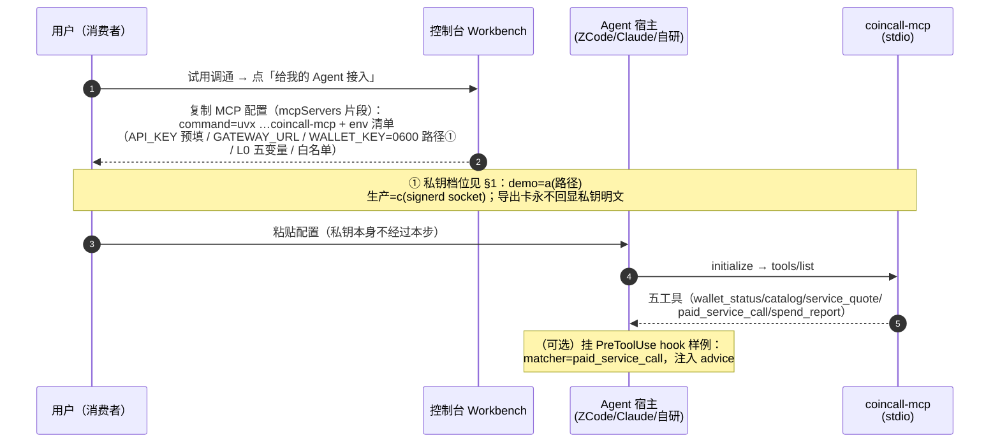
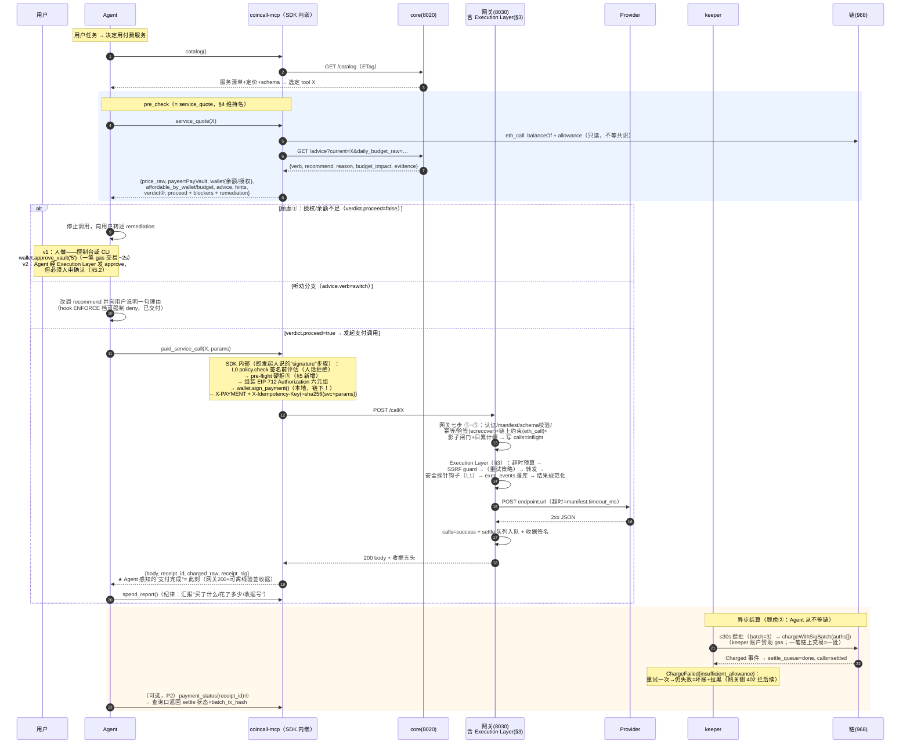

# Agent Execution Layer 与消费者全流程目标态设计（含私钥配置方案）

> 状态：设计稿（2026-10-07）。纯设计，未改任何代码。
> 发起人命题（原话浓缩）：Agent 配置平台 MCP（**私钥如何配置没想好**）→ list_tools → 把准备调的 tool 请求 **pre_check_advice** 检验 → 确定使用时调 **signature 发起支付调用**（顾虑①**授权金额不足**会让 Agent 白跑多次调用拿不到真实数据；顾虑②**链上支付时间**）→ 平台中转执行（**重试、超时、安全检查（投毒）、日志**——可能抽象一个 **Agent Execution Layer**）→ 结果返回 Agent。
>
> 方法：先逐文件核对现状代码（`coincall-sdk/tools/mcp_server.py`、`coincall-sdk/coincall/{client,wallet,policy,signing}.py`、`coincall-gateway/app/modules/{call_route,providers,keeper,receipt,calls}.py`、`coincall-core/app/modules/decision.py` 的 /advice、`skills/coincall-consumer/`），再写设计。本文不是推翻现有件，是**编排、补缺与命名对齐**。

---

## 0. 现状对照：发起人流程逐步映射（先回答"哪些其实已存在"）

| 发起人心智模型中的步骤 | 现状件（已存在，对应 X） | 缺口 |
|---|---|---|
| Agent 宿主配置 MCP server | `coincall-mcp` stdio server（`uvx --from coincall-sdk coincall-mcp`）；控制台「给我的 Agent 接入」导出卡已交付（`coincall-console/src/components/AgentExportCard.tsx`） | 私钥配置档位（§1，发起人"没想好"的唯一真空白） |
| 挂载 list_tools | `tools/list` → 五工具 TOOLS_SPEC（mcp_server.py） | 无 |
| catalog 发现服务 | `catalog` 工具 → core `GET /catalog`（ETag 缓存） | 无 |
| **pre_check_advice 检验** | `service_quote` 工具**已内嵌**：定价/收款方/余额/授权（eth_call 实读）/L0 预算余量/**advice**（core `GET /advice` 判定式投影，3s 短超时降级）+ hints 人话 | 语义等价但名字不同（§4 评估改名/独立工具/维持） |
| Agent 听劝决策 | 三通道已交付：quote 内嵌（默认）+ PreToolUse hook 样例（`skills/coincall-consumer/hooks/pretooluse.py`，含 `COINCALL_ENFORCE_ADVICE=1` 强制 deny 档）+ `Client.advice()` | 无 |
| **signature 发起支付调用** | 签名**不是独立工具**：`Client.call()` 内部自动组装 EIP-712 Authorization 并 `wallet.sign_payment()` → X-PAYMENT 头（client.py L188-206） | 无——"签名工具"的正确形态就是 SDK 内嵌步骤（独立签名工具反而放大攻击面，§2 注） |
| 授权金额不足的感知 | quote/wallet_status 已 eth_call 查 allowance 并给 hint；网关 ⑤ 验签时再查（insufficient_allowance 402 质询）；keeper ChargeFailed→重试一次→坏账拉黑兜底 | **SDK 签名前无 pre-flight 硬拒**——Agent 仍会签+发一次注定 402 的请求（§5 方案） |
| paid_service_call | 已存在（L0 policy.check 签名前评估 → 签名 → POST） | 无 |
| 中转执行（重试/超时/安全/日志） | 网关七步中的 ⑥：**超时**按 manifest timeout_ms（硬顶 60s）已有；**日志**=calls 表（latency_ms/result_hash/payment_nonce）已有；**SSRF 护栏**字面量版已挂（providers.py `_guard_forward_url`）；**重试**没有（ProviderError 单次即 aborted 502）；**投毒探针**未实现（api-security-probe.md L1 双拍仅设计） | 重试/安全钩子/执行轨迹是**真新建件**（§3） |
| 结果+收据返回 | Ed25519+HMAC 双签收据五头（X-Receipt-Id/-Ts/-Sig/-Sig-Ed25519/X-Charged-Raw），公钥 `GET /internal/receipts/pubkey` 离线可验 | 无 |
| （异步）结算状态查询口 | settle_queue/calls.status=settled 网关侧已有；**消费者侧无查询端点**；SDK ledger 的 onchain 段 `record_onchain()` **无任何调用方**（断线未接） | 小缺口（§4 payment_status 评估） |

**总判断先行**：发起人描述的流程 **约 90% 已存在**。真正的空白只有四件：私钥配置档位（§1）、SDK pre-flight 硬拒（§5）、Execution Layer 的重试+安全钩子+执行轨迹（§3，**这是唯一"真有新执行层要建"的部分**）、结算状态查询口（§4，小件）。设计的本质是"把已有件按发起人心智模型重新命名与编排"为主、局部真新建为辅。

---

## 1. 私钥配置方案对比（第一优先——发起人"没想好"处）

先框定事实：整个链路里私钥要做的密码学操作**极小**——每笔付费调用一次 EIP-712 `sign_payment(auth)`，加上一次性的 approve/mint raw tx（`wallet.py` 的 `_send_signed`）。目标态里没有任何"转账工具"。这决定了：**签名面越窄，隔离方案越便宜**。

### 1.1 四档+一对照

| 档 | 形态 | 配置体验（demo 现场） | 安全增益（挡什么） | 改动量 | 推荐场景 |
|---|---|---|---|---|---|
| **a) 裸 env/文件（现状）** | `COINCALL_WALLET_KEY=0x…` 或指向 0600 文件路径（`resolve_private_key` 已实现：hex 直传/文件/环境变量名间接，文件权限强制 0600，越权即拒载） | **0 分钟**（已交付）；变体"0600 文件路径"比 env 明文多一步 `chmod`，~1 分钟 | 静态纪律（不落日志/不进网络载荷/repr 不泄露——均已实现）；**进程沦陷即失钥**（env 可被 /proc、子进程继承、core dump 读到） | 0 | demo、本地开发、小额专用钱包 |
| **b) OS keychain 桥** | MCP server 装配时从 macOS Keychain（`security find-generic-password -w coincall-wallet`）/ Linux secret-service 读钥**进内存**，key 不落 env/文件；配合控制台导出卡给一键写入命令与 launchd/env 注入链说明 | ~3 分钟（Mac：`security add-generic-password` 一条命令 + 配置写 key 名而非钥值） | 钥**静态存储**进 OS 级加密（FileVault/钥匙串）；env/文件/备份泄露面消除。**进程运行时沦陷仍可读内存**——增益是 at-rest，不是 in-memory | SDK `resolve_private_key` 加一个 `keychain://` 前缀来源（~40 行）+ 文档；0 人日风险 | Mac 个人用户的"一键升级档" |
| **c) 签名代理进程（生产主推）** | 私钥住在一个**独立小进程**（~200 行，unix socket 本地 IPC），只暴露两个接口：`sign_payment(digest)` 与 `send_approve(amount)`；**L0 策略引擎随钥搬进代理**（签名前评估在钥匙旁执行，Turnkey"策略在 enclave 内先于签名"范式的本地版）；MCP server 永不接触钥本体，只持 socket 句柄 | ~10 分钟（多跑一个 `coincall-signerd` 命令 + 配置指向 socket 路径） | MCP server/Agent 宿主进程沦陷**≠失钥**；攻击者只能**经策略受限的签名口**发起请求（白名单/三重预算/速率在代理内强制——把 agent-wallet-trust T3/T4 的"进程内任意签名"缺口收窄到"策略内签名"）。socket 权限 0600 + 同 UID 限制 | 新增 `tools/signerd.py`（~200 行）+ SDK `LocalWallet` 抽出 `SignerProtocol`（sign_payment 走本地或走 IPC，~60 行）≈ 1.5~2d | 生产/长期运行的个人 Agent |
| **d) 外部签名器（硬件钱包/Keystone/Keystore）** | MCP 每次付费调用请求外部设备做 EIP-712/personal_sign；approve 亦设备确认 | demo 现场不可行（每笔都要人按设备，且 eth_account 不直连硬件钱包，需 USB/HID 栈）；Keystone 气隙扫码无法自动化 | **最高**：私钥物理隔离，恶意进程完全摸不到钥 | 高（设备集成+依赖，且 968 测试链需自定义 derivation）——不做 | 大额、人盯着的半自动操作；**不适合自主 Agent 场景**（与"Agent 自主花钱"的产品叙事冲突） |
| *e) 会话密钥托管（Privy/Turnkey TEE）——仅对照* | 私钥/签名权交第三方 TEE 基础设施，策略在其内执行 | 不可行：BOT Chain 968 不在其支持列表 | 理论最高（进程沦陷也绕不过） | — | **不采用**：与铁律 P7"资金永不过平台手"及"平台不碰私钥"的信任叙事冲突（agent-wallet-trust §2.5 已裁决为对照组）；其"默认拒绝+策略先于签名"四原则已被 L0/c 档吸收 |

### 1.2 推荐：demo 用 a（0600 文件路径变体），生产建议 c，b 作中间档

- **demo 现场定档 a**，且用 **0600 文件路径变体**而非 env 明文：控制台导出卡已生成 `WALLET_KEY=<路径>` 形态（consumer-agent-interface §3"绝不包含私钥明文"）；现场零新增步骤、零新故障点。话术："专用钱包只放演示小额，最坏损失=钱包余额"（agent-wallet-trust 劝退项第 6 条）。
- **生产建议 c**：这是唯一同时回应"Agent 宿主进程不可信"（宿主插着别的 MCP、跑着别的工具、可能被注入）与"Agent 要自主花钱"两个要求的档——**隔离的不是私钥的存储，是签名的决策权**。且实现便宜：签名面已被 X-PAYMENT 形态收窄到两个操作，代理进程可以小到能让人十分钟读完（对照闭源 TEE 策略引擎的透明度优势，agent-wallet-trust §3 审计结论）。
- b 是给不愿跑额外进程的 Mac 用户的"半档"，改动 40 行，顺手做。
- d/e 明确不进 roadmap 主线，写进 deck 的"安全升级路径"一页即可（c → d 用于大额人审场景）。

**与既有信任主张的一致性**：a/b/c 三档钥匙都在消费者本机，P7（资金永不过平台手）与 A1（钥只进内存与本地存储）不破。c 档把 L0 从"MCP server 进程内"搬到"signerd 进程内"，**策略执行点更靠近钥匙**，是对 agent-wallet-trust L0 的强化而非重构——`policy.check()` 代码原样复用。

---

## 2. 全流程时序图（发起人目标态 → 精确化）

### 2.1 配置期（一次性）



### 2.2 任务期（成功主路径 + 两个顾虑的失败分支）



脚注（贴 deck 时保留）：
① `WALLET_KEY` 值为路径/键名/ocket 引用，**私钥明文永不进宿主配置文件**——三档统一纪律。
② `verdict` 为 §5 新增的结构化硬信号（现 hints 是建议式文本，机器不可靠判定 proceed/stop）。
③ pre-flight：签名前本地 eth_call 复核 balance/allowance，不足→**零签名零请求**直接返回结构化指引（现在会白签白发一次注定 402 的请求）。
④ 现缺口：网关无消费者侧结算查询端点，SDK `record_onchain()` 无调用方（§4）。

### 2.3 顾虑②的精确回答：哪些环节等链、谁感知什么

| 环节 | 等链？ | 耗时量级 | 谁等 |
|---|---|---|---|
| approve（一次性准备） | **是**（gas 交易） | ~2s 出块 | v1 人等（控制台/CLI）；v2 Agent 发起但人审后等 |
| 每次付费调用：EIP-712 签名 | 否（**链下本地签名**） | <10ms | 无人等 |
| 网关 ⑤ 链上约束检查 | 只读 eth_call（经 bot-chain-api，结果短缓存） | ~几十 ms | 网关内部，对 Agent 透明 |
| 调用返回（=Agent 的"支付完成"） | 否 | Provider p95 内 | Agent 等——**已实现**：200+Ed25519 收据即支付凭证 |
| 链上结算 | **异步**：keeper ≤30s 攒批 + 出块 | 30s 档（batch=3） | **无人等**；事后可查（payment_status/console/Charged 事件） |

**结论（文档化口径）**：后付费（postpay）语义下 **Agent 签名 ≠ 上链**；"支付确认"（网关 200+收据）与"结果返回"（同一响应体）本就同步，与"链上确认"（keeper 异步批量）解耦——**这不是要改的设计，是要写清楚的设计**（当前代码已如此，缺的是 Agent 视角的文档化，即本节）。

---

## 3. Agent Execution Layer 抽象设计（发起人的核心新概念）

### 3.1 定位判断：网关内重构出的执行管线，不新建服务

**推荐：把 `call_route.py` ⑥（`_forward_and_finalize`）重构为显式管线，即"Agent Execution Layer"**，而非独立服务。理由：

1. 执行管线需要的前置上下文（manifest/已验签的 payment_ctx/call_id/影子闸门句柄）**全部在网关请求生命周期内**——拆服务意味着跨进程传递 X-PAYMENT 上下文与 calls 写锁（C-14 单进程单写者纪律会被迫打破）；
2. 发起人的四件事（重试/超时/安全/日志）的**挂点都在 ⑥ 内部**：①~⑤ 是资金面（验签/闸门/幂等），⑦ 是收据面——Execution Layer 恰好是中间的"数据面执行"，边界天然干净；
3. 独立服务引入一跳网络+序列化，对 booth demo 是纯负资产。

**边界定义**：Execution Layer **只做数据面**——接收"已验签、已过闸门"的调用，负责把请求可靠、安全、可观测地送到 Provider 并把结果规范化回来。它**不碰资金语义**：不验签、不放行闸门、不签收据、不结算（enqueue_settle 保持在成功出口处调用，keeper 消费不变）。

### 3.2 管线接口（Protocol 草图）

```python
# app/modules/execution.py（新文件；call_route._forward_and_finalize 的重构归宿）

@dataclass(frozen=True)
class ExecContext:
    call_id: str
    manifest: ManifestInfo          # 含 endpoint.url / timeout_ms / method / output_schema
    body: Any
    payment_ctx: XPayment           # 仅用于事件留痕（金额/nonce），不参与执行决策
    consumer_key_id: str

@dataclass
class ExecResult:
    status_code: int
    body: Any                       # 已规范化（截断/安全包装后）
    result_hash: str
    attempts: int
    events: list[ExecEvent]         # 本管线产生的结构化事件（落 exec_events 表）

ExecFn = Callable[[ExecContext], Awaitable[ExecResult]]   # 管线终点的 provider.forward

class ExecMiddleware(Protocol):
    name: str
    async def wrap(self, ctx: ExecContext, next_: ExecFn) -> ExecResult: ...

class ExecutionLayer:
    """组装中间件链并执行。路由层只调它，不再直触 provider。"""
    def __init__(self, provider: ProviderAdapter, middlewares: list[ExecMiddleware]) -> None: ...
    async def execute(self, ctx: ExecContext) -> ExecResult: ...

# V1 中间件链（顺序=外到内）：
# TimeoutBudget   总预算=manifest.timeout_ms，多次重试共享同一 deadline；超时→ProviderError→aborted 零扣款
# RetryPolicy     仅对"未达 Provider 的连接错误"与"GET 服务 5xx"有界重试（≤2 次尝试）；
#                 POST 5xx 不自动重试（Provider 副作用不可知，留给消费者层幂等键重放）
# SecurityProbe   转发前：SSRF guard（现有 _guard_forward_url 移入）；
#                 转发后：api-security-probe L1 同步拍——精确匹配（凭据回显→502 拦截，零扣款）、
#                 正则类（injection/密钥形态→包装 _security.flagged 不拦）、行为类（>256KB 截断、
#                 output_schema 校验、result_hash 重复率）
# EventLog        每阶段（attempt/timeout/retry/security_flag/truncated）append 进 exec_events 表
# Normalize       结果包装（安全标记）、截断、result_hash —— 终点前最后一站
```

**与三条关键既有语义的咬合**：

- **幂等键与"失败不扣款"**：管线内重试是**网关→Provider 的同请求内重试**，与消费者 `X-Idempotency-Key` 无关；消费层的失败重试（Agent 重发同键同参）由 ④ 幂等重放挡住双扣（已实现）。无论哪层重试，**最终失败=aborted=从未扣款**（02 §3 关键决策，v2 无退款逻辑因为不需要退款）——重试策略不触碰该不变量：settle 队列只在 2xx 出口写入。
- **与 keeper/settle_queue 的边界**：`enqueue_settle` 从 `_forward_and_finalize` 移到管线的**成功出口钩子**（语义不变，代码位置变）；keeper 的攒批/坏账/拉黑逻辑零改动。
- **与收据的边界**：`build_receipt`/双签头留在路由层 ⑦——收据的 `result_hash` 取**规范化后**的 body hash（现状即转发体 hash；引入截断/包装后必须明确以最终交付体为准，避免消费者持据验hash 不一致）。

### 3.3 结构化日志：exec_events 独立表（不动 calls 冻结契约）

calls 表是 04/06 的共享契约（02 §5"字段冻结"）——**加列=契约级变更，不做**。推荐独立 append-only 表：

```sql
CREATE TABLE exec_events (
  event_id VARCHAR PRIMARY KEY, call_id VARCHAR, stage VARCHAR,
  -- stage ∈ {attempt, retry, timeout, ssrf_blocked, security_intercept,
  --          security_flag, truncated, schema_violation, settle_enqueued}
  detail JSON, created_at TIMESTAMP DEFAULT now()
);
```

好处：调用详情（`/internal/stats/calls`、06 数据面）聚合时 join 可选；安全事件（api-security-probe L2 的 security_events）可由同一通道派生；calls 行保持一行一调用的窄表语义。

### 3.4 分阶段落地（重构不改行为 → 逐件加能力）

| 阶段 | 内容 | 量级 |
|---|---|---|
| E1 | 抽 `execution.py` 管线 + 中间件化改造，**行为与现状完全一致**（仍是单次转发+SSRF guard+calls 落库），测试护栏先行 | 0.5~1d |
| E2 | TimeoutBudget + RetryPolicy（有界、共享 deadline） | 0.5d |
| E3 | SecurityProbe 同步拍（依赖 api-security-probe.md L1 实施）+ exec_events 表 + Normalize 截断 | 1~1.5d |
| E4 | 异步重检协程挂载（正则全集/可选分类器，复用 keeper 常驻任务模式） | P2 |

---

## 4. 工具面变化评估

### 4.1 pre_check_advice：维持 `service_quote` 名，不加独立工具，description 强化

三个候选的判断：

| 候选 | 判断 | 理由 |
|---|---|---|
| 改名 `service_quote` → `pre_check_advice` | **不做** | ①工具名是散布契约：SKILL.md 流程、CLI（`call.py quote`）、控制台导出文案、hook 文档、AIsa 式"quote 纪律"心智（search→schema→**quote**→call）全在引用它；②发起人想要的"返回校验数据供 Agent 判断"——quote 返回的 advice+affordability+verdict **已经是**这个集合的全集，改名不增能力只破契约 |
| 加独立薄工具（直接映射 GET /advice） | **不做** | ①与发起人自己的痛点冲突——"不想让 Agent 执行太多工具调用"：独立 advice 工具会把 pre-check 从一次调用变两次（quote 查授权 + advice 查建议），而两者必须**合并判定**（verdict=advice∧授权∧预算）才有"该不该继续"的答案；②六工具比五工具更稀释 Agent 的选择准确度 |
| **维持现状 + 微调** | **推荐** | ①description 首句改为"**pre-check（付费前统一检验步）**：定价/收款方/余额与授权充足性/L0 预算余量/平台建议（advice）一次返回"；②返回体加 `verdict` 硬信号字段（§5）；③SKILL.md 流程第 3 步同步一句。改动 ~15 行+两句文档 |

一句话给发起人：**pre_check_advice 已经存在，它叫 `service_quote`，且比设想的更强（不仅建议，还带授权充足性与预算判定）**。若赛后续要面向"只想要建议"的轻量场景（如非 MCP 宿主），`Client.advice()` 与 `GET /advice` 已是独立可用口，无需新工具。

### 4.2 payment_status：P2 可选薄工具，先补网关查询端点与 SDK 回填

现状核对：`spend_report` 的 ledger 设计了 intent→receipt→**onchain** 三段，但 `record_onchain()` **无任何调用方**（grep 全仓仅定义处）；网关只有 `/internal/stats/calls`（聚合）与 `/internal/keeper/status`（运维），**无消费者侧"我的签名是否已结算"查询口**。

- **推荐切分**：①网关加只读端点 `GET /receipts/{receipt_id}/settlement` → `{call_id, settle_status: pending|settled|bad_debt|expired, batch_tx_hash?, charged_at?}`（calls×settle_queue join，~40 行）；②SDK 在 `spend_report` 时惰性拉取并**回填 ledger.onchain 段**（打通既有断线，~30 行）；③MCP 薄工具 `payment_status(receipt_id)` 映射该端点（~20 行）——**仅在演示需要"Agent 自己查链上确认"剧情时加**，否则控制台/keeper status 已够。
- 定位 P2 的理由：后付费语义下消费者**不依赖结算状态**（收据即支付凭证，坏账风险在平台侧由拉黑兜底）；此工具价值是透明度（T5 审计闭环的最后一格）与 demo 叙事（"30 秒后 Charged 事件上链，Agent 可查"），不是功能必需。

### 4.3 工具面目标态（六件套封顶）

```
wallet_status / catalog / service_quote(=pre_check) / paid_service_call / spend_report
（+可选 P2：payment_status）
```

---

## 5. 安全与体验的平衡点（发起人两个痛点的回扣）

### 5.1 痛点①"Agent 执行太多工具调用却拿不到真实数据"——根因与三层收口

**根因分析**：白跑只发生在"授权不足/余额不足仍发起调用"——现状有四道信号（wallet_status 自查纪律、quote hints、affordable 布尔、网关 402 人话）但**全是建议式或事后式**：纪律是概率性的（LLM 可能跳步），hints 是文本（模型可能忽略），402 是失败后（请求已白发一轮）。最坏路径 = Agent 跳过 quote 直接 call → 网关 402 → 拿不到数据 → （若违反铁律）再试下一个服务 → 再 402——每轮都在烧上下文与轮次。

**三层收口（建议式→结构化→硬性）**：

1. **结构化硬信号（SDK，P1）**：`service_quote` 返回体加 `verdict`：
   ```json
   "verdict": {"proceed": false,
     "blockers": ["insufficient_allowance"],
     "remediation": {"action": "approve", "spender": "0x…PayVault",
       "suggested_amount_raw": 5000000, "note": "approve 是链上 gas 交易，需用户操作"}}
   ```
   SKILL.md 纪律改一句："`verdict.proceed=false` → **停止并报告**，不发起 paid_service_call，不换服务重试"——把"听劝"从读自由文本变成读一个布尔。
2. **签名前 pre-flight 硬拒（SDK，P1，~30 行）**：`Client.call()` 在 `policy.check` 后、组装 Authorization 前本地 `wallet.balance()` 复核（eth_call 只读，~几十 ms；链不可达时降级放行——网关 ⑤ 仍是权威）。不足→**零签名、零请求**，直接抛带 remediation 的结构化错误。这一层**不依赖 Agent 听话**，是确定性的。
3. **可选 hook deny 档（宿主，0 改动）**：现有 `pretooluse.py` 已示范 `COINCALL_ENFORCE_ADVICE=1` 的 deny 语义；同理可扩 `verdict/enforce`（hook 查不到钱包态——私钥在 MCP server 进程内，hook 不应持有——所以 hook 档只能强制 advice 语义，钱包硬拒交给 SDK 层，**两层各管各的**）。

### 5.2 授权不足时的 approve：谁做？

| 版本 | 方案 | 理由 |
|---|---|---|
| **v1（demo/当前）** | **人做**：控制台一键 approve 或 CLI `wallet.approve_vault('5')`；Agent 的职责止于**转述 remediation**（金额、目标、为什么） | approve 是唯一需要 gas 的链上交易，是资金主权的显式动作；demo 现场这也正是"人在环上"的演示点 |
| v2（赛后） | Agent 经 Execution Layer 发起 approve 请求 → **必须人审确认**（复用 agent-wallet-trust L1 审批门：`单笔/新目标 → pending_approval，签名不发生`）→ 批准后由签名代理（§1c）执行 | 把 approve 从"人手做"变"人批 Agent 做"；签名代理内策略限定 approve 目标恒为 PayVault（硬编码不变量已存在于 L0 设计） |

**不建议**：让 Agent 无审查自动 approve——那等于把"日额上限"的真实边界从用户设置的 budget 变成钱包全额，L0 的意义被抽空。

### 5.3 痛点②"链上支付的时间"：明确口径（表见 §2.3）

三句话版本（可直接进 deck）：
1. **Agent 的每次调用不等任何链上写**——签名是链下 EIP-712，网关只做只读 eth_call，响应在 Provider p95 内返回；
2. **"支付完成"的 Agent 定义 = 网关 200 + 收据**（Ed25519 离线可验）——已实现，不是待办；
3. **链上确认是 keeper 的异步批量**（≤30s 攒批 + 出块），期间与之后消费者的资金承诺由签名+收据+影子闸门三重界定，坏账由平台拉黑兜底——消费者无需感知，想感知时可查（§4.2）。

---

## 6. 落地切分与改动面

**诚实判断**：发起人目标态流程**不是新建系统，是对既有件的重新编排与三处补缺**。全流程时序（§2）除四处标注外均对应已交付代码；Execution Layer 中"超时/日志/SSRF/幂等/零扣款"已有雏形，**真正新建的是重试策略、安全探针钩子、exec_events 轨迹**三件（且安全探针的详细设计已由 api-security-probe.md 完成，此处只是给它管线挂点）。

| # | 事项 | 仓 | 类型 | 量级 | 复用/依赖 |
|---|---|---|---|---|---|
| P0-1 | 私钥配置 demo 定档 a（0600 路径）+ 导出卡/文档口径更新 | docs+console 文案 | 文档 | 0.25d | AgentExportCard 已在 |
| P0-2 | `service_quote` description 强化 pre-check 语义 + `verdict` 字段 + SKILL.md 一句 | coincall-sdk | SDK | 0.25d | quote 载荷构造已有 |
| P0-3 | §2 时序图与 §5.3 口径进 deck/文档 | docs | 文档 | 0.25d | 本文档即产物 |
| P1-4 | `Client.call()` pre-flight 硬拒（签名前 eth_call 复核） | coincall-sdk | SDK | 0.5d | `wallet.balance()` 已有 |
| P1-5 | Execution Layer E1：管线抽象重构（行为不变+测试） | coincall-gateway | 网关重构 | 0.5~1d | `_forward_and_finalize` 现有代码 |
| P1-6 | E2：超时预算+有界重试 | coincall-gateway | 网关 | 0.5d | manifest.timeout_ms 已有 |
| P1-7 | E3 前半：exec_events 表 + Normalize（256KB 截断/包装） | coincall-gateway | 网关 | 0.5d | calls 表不动（冻结契约） |
| P2-8 | E3 后半：L1 安全探针挂进管线（凭据回显拦截/注入标记） | coincall-gateway | 网关 | 1~1.5d | api-security-probe.md §3 设计 |
| P2-9 | 结算查询口：`GET /receipts/{id}/settlement` + SDK ledger.onchain 回填（+可选 payment_status 工具） | gateway+sdk | 两仓 | 0.5~1d | settle_queue/calls 已有 |
| P2-10 | 私钥档 b：keychain 来源（`keychain://` 前缀） | coincall-sdk | SDK | 0.5d | `resolve_private_key` 扩展点 |
| 赛后-11 | 私钥档 c：`coincall-signerd` 签名代理（L0 随钥搬入） | coincall-sdk | 新进程 | 1.5~2d | policy.py 原样搬 |
| 赛后-12 | approve 人审通道（v2） | sdk+console | 功能 | 1d+ | agent-wallet-trust L1 设计 |

P0+P1 合计 ≈ 2.5~3 人日即可让"发起人目标态"在 demo 与代码两侧都成立；P2 与赛后项是渐进强化，不阻塞任何演示。

---

## 7. 诚实边界与未决

1. **pre-flight 与网关 ⑤ 存在 TOCTOU 窗口**（本地查完 allowance 到网关验签之间额度可能变化）——pre-flight 定位是体验层止损，资金权威永远在网关 eth_call + 影子闸门 + 合约 transferFrom 三处，不能也不需消除该窗口。
2. **重试策略对 POST 服务的覆盖有限**：Provider 副作用不可知，v1 只重试连接级错误与 GET 5xx；POST 的最终一致性交给消费者层幂等键重放。若未来 manifest 增加幂等声明（`idempotent: true`），可放开 POST 重试——契约变更，暂不做。
3. **安全探针的误报边界**沿用 api-security-probe.md §6：正则挡剧本化投毒挡不住语义级对抗；同步拦截仅限零误报的精确匹配类。
4. **签名代理（档 c）防不住同 UID 恶意进程的 socket 劫持**——unix socket 0600 + 同 UID 边界在桌面威胁模型内是务实线，不是硬边界；跨用户场景需 agent 每次授权（趋近档 d）。
5. `payment_status` 与 settle 状态的语义对齐依赖 keeper 的 `EXPIRED`（validBefore 过期作废=从未扣款）状态在查询口的正确呈现——实施时需与 keeper 状态机对表（pending/done/failed/expired 四态）。
6. 发起人流程中"平台帮助 Agent 进行请求中转"的**平台中心化拓扑**保持不变——Execution Layer 不改变"网关是唯一转发咽喉"的结构（SSRF/凭据注入/收据/结算都锚在这一个点上），这是特性不是局限。

---

*本文档仅写入 `coincall-docs/design/`，未改动任何代码。现状引用均经代码核对：`coincall-sdk/tools/mcp_server.py`（五工具+advice 内嵌）、`coincall-sdk/coincall/{client,wallet,policy}.py`（签名/L0/账本）、`coincall-sdk/skills/coincall-consumer/hooks/pretooluse.py`（hook 样例）、`coincall-gateway/app/modules/{call_route,providers,keeper,receipt,calls,receipts_route,stats_route}.py`（七步时序/SSRF/结算/收据/路由面）、`coincall-core/app/modules/decision.py:805`（GET /advice）、`coincall-console/src/components/AgentExportCard.tsx`（导出卡）。*
